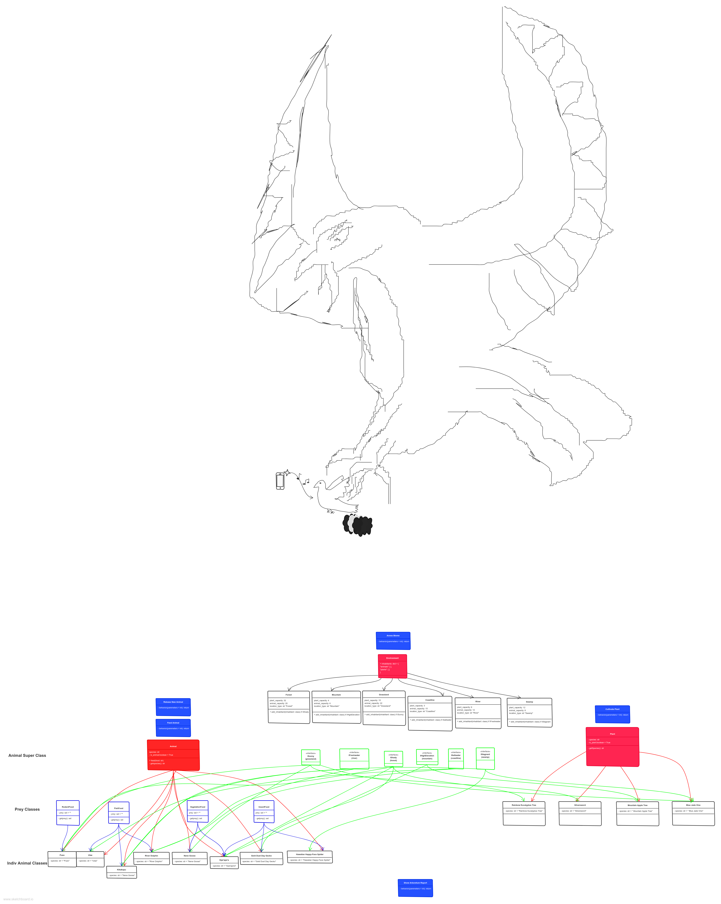

# Keahua Arboretum

You and your friends have decided to connect with the earth again and abandon your reliance on technology and urban vices. You have decided to move to Hawaii and join the land management team for the Keahua Arboretum.

You have met with other foresters and land managers and have decided on the animals and plants below to focus on growing and maintaining for the arboretum.

# Getting Started

1. Clone the repository
1. `cd` into the project directory
1. Run the command `pip install -r requirements.txt`
1. Run the command `python index.py` to start the application

# Team Sketchboard

